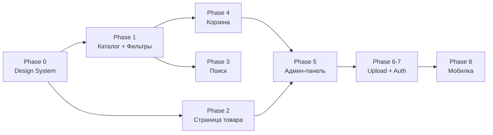

# KAMA Pajama Store — Implementation Plan

Полный рефакторинг каталога-сайта пижам по новому ТЗ. Переход от Material 3 оранжевой темы к мягкому/уютному дизайну с пастельными тонами, замена иконок, библиотек, реструктуризация маршрутов и добавление недостающей функциональности.

---

## Решения по ТЗ

| Вопрос | Решение |
|---|---|
| Шрифт | **Borel** для лого и всех заголовков, **Nunito** для текста |
| Иконки | **Font Awesome** (оставляем текущий) |
| Язык | **Русский + Узбекский** через `next-intl` |
| Пагинация | Кнопочная пагинация |
| Цены | Float в сумах |

---

## Proposed Changes

### Phase 0: Design System Foundation

Полная замена цветовой палитры, типографики и токенов компонентов.

---

#### [MODIFY] [package.json](file:///Users/farkhodov/Desktop/KAMA-pajama-store/package.json)

**Добавить зависимости:**
| Пакет | Зачем |
|---|---|
| `embla-carousel-react` | Галерея фото на странице товара — замена Swiper |
| `react-hook-form` | Форма заказа в корзине |
| `use-debounce` | Debounce поиска (300ms) |
| `nuqs` | URL search params как state для фильтров |
| `next-intl` | i18n — русский и узбекский языки |

**Удалить зависимости:**
| Пакет | Причина |
|---|---|
| `swiper` | Заменяем на embla-carousel |
| `framer-motion` | Не нужен по новому ТЗ |

> [!NOTE]
> `zod`, `@fortawesome/*` уже установлены и остаются. `tailwindcss` v4 также уже есть.

---

#### [MODIFY] [globals.css](file:///Users/farkhodov/Desktop/KAMA-pajama-store/src/app/globals.css)

Полная перезапись CSS-токенов и базовых стилей:

**Текущее состояние** → Material 3 оранжевая палитра (`--md-primary: #9D3A0E`, `--font-body: 'Plus Jakarta Sans'`), ~1800 строк CSS.

**Новое состояние** → Мягкая пастель по ТЗ:
```css
:root {
  --bg: #FEF6F0;
  --surface: #FFFFFF;
  --primary: #E8A4B0;
  --primary-dark: #C0607A;
  --subtle: #FEF0F4;
  --border: #F0E4E0;
  --text: #3D2F2F;
  --text-muted: #B08090;
  --shadow: 0 2px 16px rgba(180,120,140,0.1);
  --radius-card: 24px;
  --radius-btn: 50px;
  --radius-input: 14px;
  --radius-badge: 50px;
  --font-heading: 'Borel', cursive;
  --font-body: 'Nunito', sans-serif;
}
```
Переписываем все компоненты: кнопки (pill/ghost), карточки, навигацию, hero, sidebar, input, badge, footer.

---

#### [MODIFY] [layout.tsx](file:///Users/farkhodov/Desktop/KAMA-pajama-store/src/app/layout.tsx)

- Заменить `Plus_Jakarta_Sans` → `Nunito` от Google Fonts
- Заменить `Playfair_Display` → `Borel` для заголовков и лого
- Обновить metadata: `themeColor` → `#FEF6F0`
- Убрать `framer-motion` из импортов Header
- Перестроить структуру под `[locale]` для i18n (next-intl)

---

#### [MODIFY] [constants.ts](file:///Users/farkhodov/Desktop/KAMA-pajama-store/src/lib/constants.ts)

- `THEME_COLOR` → `"#FEF6F0"`
- `BACKGROUND_COLOR` → `"#FEF6F0"`

---

### Phase 0.5: Интернационализация (i18n)

Добавление поддержки русского и узбекского языков через `next-intl`.

---

#### [NEW] [messages/ru.json](file:///Users/farkhodov/Desktop/KAMA-pajama-store/messages/ru.json)

Все строки интерфейса на русском: навигация, фильтры, корзина, формы, статусы.

---

#### [NEW] [messages/uz.json](file:///Users/farkhodov/Desktop/KAMA-pajama-store/messages/uz.json)

Все строки интерфейса на узбекском (перенос текущих строк из кода).

---

#### [NEW] [src/i18n/routing.ts](file:///Users/farkhodov/Desktop/KAMA-pajama-store/src/i18n/routing.ts)

Конфигурация `next-intl`: supported locales (`ru`, `uz`), default locale.

---

#### [NEW] [src/i18n/request.ts](file:///Users/farkhodov/Desktop/KAMA-pajama-store/src/i18n/request.ts)

Серверная загрузка сообщений по текущему locale.

---

#### [MODIFY] [middleware.ts](file:///Users/farkhodov/Desktop/KAMA-pajama-store/src/middleware.ts)

- Интегрировать `next-intl` middleware для определения locale
- Сохранить защиту `/admin/*` маршрутов

---

#### [MODIFY] Структура маршрутов → `app/[locale]/...`

- Перенести все страницы (кроме API routes) в `app/[locale]/`
- Layout обёрнут в `NextIntlClientProvider`
- Язык переключатель в Header/Footer

---

### Phase 1: Каталог с фильтрами + карточки товаров

Главная страница становится каталогом. Добавляется боковая панель фильтров с URL-синхронизацией.

---

#### [MODIFY] [page.tsx](file:///Users/farkhodov/Desktop/KAMA-pajama-store/src/app/page.tsx) → `(catalog)/page.tsx`

Текущее: домашняя страница с Hero, Categories, PopularProducts, Features, Newsletter.
Новое: SSR-каталог с сеткой карточек, FilterSidebar, сортировкой и пагинацией.

- Серверный компонент: получает товары через Prisma с фильтрацией по URL params
- Рендерит `FilterSidebar` + `ProductGrid`
- Передаёт фильтры из `searchParams`

> [!NOTE]
> По ТЗ, route group `(catalog)` используется чтобы главная `/` была каталогом. Можно обойтись без route group — просто переписать `page.tsx`.

---

#### [NEW] [FilterSidebar.tsx](file:///Users/farkhodov/Desktop/KAMA-pajama-store/src/components/catalog/FilterSidebar.tsx)

- Controlled component: `{ filters, onChange }`
- Фильтры:
  - **Категория** — radio buttons
  - **Размер** — tag chips
  - **Цвет** — цветные кружки
  - **Цена** — два range inputs (От / До)
- Кнопка «Сбросить фильтры»
- Синхронизация с URL через `nuqs`: `?category=Женские&size=M&color=Розовый&minPrice=50000&maxPrice=100000`
- На мобиле — скрыт, открывается через Drawer (Phase 8)

---

#### [MODIFY] [ProductCard.tsx](file:///Users/farkhodov/Desktop/KAMA-pajama-store/src/components/catalog/ProductCard.tsx)

Текущее: 258 строк, Font Awesome иконки, inline SVG, M3 стили.
Новое по ТЗ:
- Фото (или placeholder emoji), название, цена, категория, badge
- Hover: `translateY(-4px)`, тень усиливается `0.2s ease`
- Click → переход на `/product/[id]`
- Кнопка «В корзину» — добавляет с первым доступным размером
- Badges: `Хит`, `Новинка`, `Скидка`, `Нет в наличии`
- Иконки из Font Awesome
- Размеры отображаются как tags (первые 3 + `+N`)

---

#### [NEW] [ProductGrid.tsx](file:///Users/farkhodov/Desktop/KAMA-pajama-store/src/components/catalog/ProductGrid.tsx)

- Responsive grid: 1 col (mobile) / 2 / 3 / 4 col (desktop)
- CSS Grid с `auto-fill, minmax(200px, 1fr)`
- Принимает массив products + sorting options

---

#### [DELETE] [Hero.tsx](file:///Users/farkhodov/Desktop/KAMA-pajama-store/src/components/home/Hero.tsx)
#### [DELETE] [Categories.tsx](file:///Users/farkhodov/Desktop/KAMA-pajama-store/src/components/home/Categories.tsx)
#### [DELETE] [PopularProducts.tsx](file:///Users/farkhodov/Desktop/KAMA-pajama-store/src/components/home/PopularProducts.tsx)
#### [DELETE] [Features.tsx](file:///Users/farkhodov/Desktop/KAMA-pajama-store/src/components/home/Features.tsx)
#### [DELETE] [Newsletter.tsx](file:///Users/farkhodov/Desktop/KAMA-pajama-store/src/components/home/Newsletter.tsx)

Вся папка `components/home/` удаляется — главная страница теперь каталог.

---

### Phase 2: Страница товара + галерея

---

#### [MODIFY] [page.tsx](file:///Users/farkhodov/Desktop/KAMA-pajama-store/src/app/product/%5Bid%5D/page.tsx)

- SSR с мета-тегами: `og:title`, `og:image`, `og:description`
- Layout: `ImageGallery` + детали (название, цена, описание, состав ткани)
- Выбор размера через `SizeSelector`
- Выбор цвета (кружки)
- Кнопка «Добавить в корзину»
- Блок «Похожие товары» — 4 карточки по той же категории

---

#### [MODIFY] [ProductDetails.tsx](file:///Users/farkhodov/Desktop/KAMA-pajama-store/src/components/catalog/ProductDetails.tsx) → `components/product/ProductDetails.tsx`

Переместить в `components/product/`, переписать:
- Убрать Swiper импорты
- Использовать `ImageGallery` (embla-carousel)
- Новые стили из дизайн-системы
- Все строки через `useTranslations()` из next-intl

---

#### [NEW] [ImageGallery.tsx](file:///Users/farkhodov/Desktop/KAMA-pajama-store/src/components/product/ImageGallery.tsx)

- Главное фото + ряд миниатюр снизу
- Swipe на мобиле через `embla-carousel-react`
- Lazy loading изображений через `next/image`
- Click на миниатюру → переключение основного фото

---

#### [NEW] [SizeSelector.tsx](file:///Users/farkhodov/Desktop/KAMA-pajama-store/src/components/product/SizeSelector.tsx)

- Визуальный выбор размера (tag-chips)
- Индикатор наличия (in stock / out of stock)
- Controlled component: `{ sizes, selected, onChange }`

---

### Phase 3: Поиск

---

#### [MODIFY] [page.tsx](file:///Users/farkhodov/Desktop/KAMA-pajama-store/src/app/search/page.tsx)

- Подсветка найденного слова в названии
- Клиентский debounce-поиск через хедер → переход на `/search?q=...`
- Если нет результатов — иллюстрация + предложение похожих товаров

---

#### [NEW] [useSearch.ts](file:///Users/farkhodov/Desktop/KAMA-pajama-store/src/lib/hooks/useSearch.ts)

- Debounced search (300ms) через `use-debounce`
- Используется в Header для real-time поиска
- Автонавигация на `/search?q=...` при вводе

---

#### [MODIFY] [Header.tsx](file:///Users/farkhodov/Desktop/KAMA-pajama-store/src/components/layout/Header.tsx)

- Оставить Font Awesome иконки для кнопок (Search, Heart, ShoppingBag, Menu)
- Добавить поисковый input с debounce (используя `useSearch`)
- Убрать `framer-motion` (motion.header → обычный header + CSS transitions)
- Новая стилизация по дизайн-системе (sticky, blur, розовые тона)
- Логотип: шрифт Borel, текст `🌸 KAMA`
- Добавить переключатель языка (RU / UZ)

---

### Phase 4: Корзина + Форма заказа

---

#### [MODIFY] [page.tsx](file:///Users/farkhodov/Desktop/KAMA-pajama-store/src/app/cart/page.tsx)

Текущее: 320 строк, `useState`-форма, Modal.
Новое по ТЗ:
- Полная страница корзины (не sidebar)
- Список: фото, название, размер, цвет, количество, цена
- Изменение количества +/- и удаление
- Итоговая сумма
- Форма заказа (`OrderForm`): имя, телефон, комментарий
- Страница подтверждения после отправки

---

#### [NEW] [CartItem.tsx](file:///Users/farkhodov/Desktop/KAMA-pajama-store/src/components/cart/CartItem.tsx)

- Props: cart item data
- Фото, название, размер, цвет, +/- количество, цена, кнопка удаления
- Font Awesome иконки (trash, plus, minus)

---

#### [NEW] [OrderForm.tsx](file:///Users/farkhodov/Desktop/KAMA-pajama-store/src/components/cart/OrderForm.tsx)

- `react-hook-form` + `zod` валидация
- Поля: имя (required), телефон (required, формат), комментарий (optional)
- Submit → POST /api/orders → redirect на подтверждение
- Красивые инпуты в стиле дизайн-системы

---

#### [MODIFY] [CartSidebar.tsx](file:///Users/farkhodov/Desktop/KAMA-pajama-store/src/components/cart/CartSidebar.tsx)

- Оставить как quick-preview sidebar (краткое превью корзины)
- Или удалить, если корзина теперь полностраничная — **обсудить**

---

### Phase 5: Админ-панель

---

#### [MODIFY] [layout.tsx](file:///Users/farkhodov/Desktop/KAMA-pajama-store/src/app/admin/layout.tsx)

- Auth guard (уже есть в middleware, проверить)
- Обновить стили под новую палитру

---

#### [MODIFY] [products/page.tsx](file:///Users/farkhodov/Desktop/KAMA-pajama-store/src/app/admin/products/page.tsx)

- Таблица с поиском и пагинацией
- Кнопки: редактировать, удалить

---

#### [NEW] [products/new/page.tsx](file:///Users/farkhodov/Desktop/KAMA-pajama-store/src/app/admin/products/new/page.tsx)

- Форма добавления товара (name, description, price, category, variants, images)

---

#### [NEW] [products/[id]/edit/page.tsx](file:///Users/farkhodov/Desktop/KAMA-pajama-store/src/app/admin/products/%5Bid%5D/edit/page.tsx)

- Форма редактирования товара (pre-filled)
- Загрузка/удаление изображений

---

#### [MODIFY] [orders/page.tsx](file:///Users/farkhodov/Desktop/KAMA-pajama-store/src/app/admin/orders/page.tsx)

- Список заявок: имя, телефон, состав заказа, дата, статус

---

### Phase 6–7: Загрузка изображений + Авторизация

Текущее состояние: загрузка в `public/uploads/products` + Auth через sessions в cookies — **уже реализовано**. Нужно только проверить и при необходимости адаптировать под Supabase Storage.

---

### Phase 8: Мобильная адаптация

---

#### [MODIFY] [MobileMenu.tsx](file:///Users/farkhodov/Desktop/KAMA-pajama-store/src/components/layout/MobileMenu.tsx)

- Обновить стили + Font Awesome иконки
- Filter Drawer на мобиле (для FilterSidebar)

---

#### [MODIFY] [BottomNav.tsx](file:///Users/farkhodov/Desktop/KAMA-pajama-store/src/components/layout/BottomNav.tsx)

- Обновить иконки Font Awesome
- Обновить стили под новую палитру

---

### Вспомогательные изменения

---

#### [MODIFY] [index.ts](file:///Users/farkhodov/Desktop/KAMA-pajama-store/src/types/index.ts)

- Проверить соответствие типов схеме БД из ТЗ, добавить missing fields если нужно

---

#### [MODIFY] [utils.ts](file:///Users/farkhodov/Desktop/KAMA-pajama-store/src/lib/utils.ts)

- `formatPrice` — формат `n.toLocaleString("ru") + " сум"` (Float, сумы)

---

#### [DELETE] [FloatingCartBar.tsx](file:///Users/farkhodov/Desktop/KAMA-pajama-store/src/components/catalog/FloatingCartBar.tsx)

Не нужен по новому ТЗ.

---

#### [DELETE] [HomeCategoryGrid.tsx](file:///Users/farkhodov/Desktop/KAMA-pajama-store/src/components/catalog/HomeCategoryGrid.tsx)

Не нужен — главная теперь каталог.

---

#### [MODIFY] [Footer.tsx](file:///Users/farkhodov/Desktop/KAMA-pajama-store/src/components/layout/Footer.tsx)

- Обновить стили + Font Awesome иконки
- Все строки через `useTranslations()`

---

## Порядок выполнения



---

## Verification Plan

### Automated Checks

1. **Build**:
```bash
cd /Users/farkhodov/Desktop/KAMA-pajama-store && npm run build
```
Должен проходить без ошибок после каждой фазы.

2. **Lint**:
```bash
cd /Users/farkhodov/Desktop/KAMA-pajama-store && npm run lint
```

### Browser Testing

После каждой фазы — запуск `npm run dev` и визуальная проверка в браузере:

| Фаза | Что проверить |
|---|---|
| 0 | Новые цвета, шрифты, базовые стили отображаются |
| 1 | Каталог рендерится, фильтры работают, URL обновляется, карточки кликабельны |
| 2 | Галерея переключает фото, выбор размера/цвета, добавление в корзину |
| 3 | Поиск с debounce работает, подсветка слов, пустые результаты |
| 4 | Корзина показывает товары, +/- количество, форма отправляет заказ |
| 5 | Админ CRUD работает, заявки отображаются |

### Manual Verification (требуется от пользователя)

- Проверить дизайн визуально на мобильном устройстве
- Проверить загрузку изображений в Supabase Storage (если настроен)
- Протестировать форму заказа end-to-end (от корзины до записи в БД)
